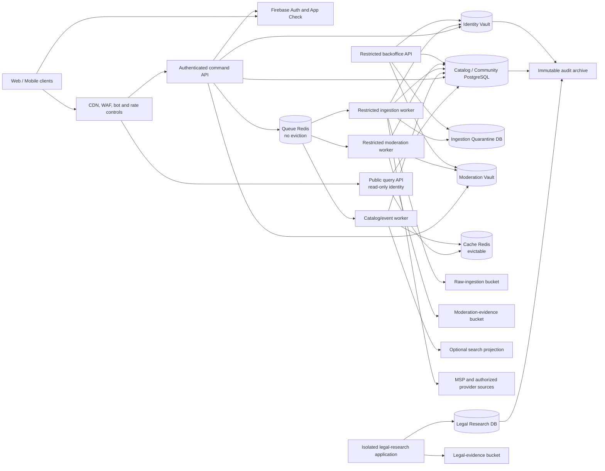
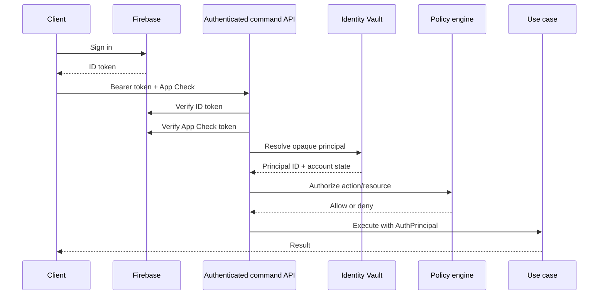
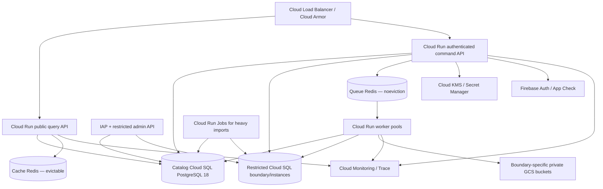

# Backend Architecture — Medical Directory Uruguay

**Status:** Foundation implemented; later modules remain proposed

**Date:** 2026-07-26

**Language:** TypeScript

**Primary use cases:** official medical directory, credentials, provider affiliations, profile claims, corrections, patient-experience reviews, moderation, source ingestion and provenance.

**Explicitly gated use case:** named judicial or disciplinary history.

This document is the implementation blueprint. The repository implements the modular foundation,
public professionals/credentials slice, provenance gates and bounded ingestion; later modules
remain intentionally gated.

## 1. Executive decision

Build a **modular monolith** in one TypeScript monorepo, deployed initially as:

1. a stateless public query API;
2. an authenticated command API;
3. separately credentialed catalog, ingestion and moderation workers;
4. a restricted backoffice API;
5. an optional, physically isolated legal-research application that remains disabled until legal authorization exists.

Recommended core stack:

| Concern | Choice |
|---|---|
| Runtime | Node.js 24 LTS |
| Language | TypeScript, strict mode |
| Package manager | pnpm workspaces |
| Framework | NestJS 11 |
| HTTP adapter | Fastify |
| Public contract | Versioned REST + generated OpenAPI |
| Primary database | PostgreSQL 18 |
| Data access | Drizzle ORM + `node-postgres` |
| Authentication | Firebase Authentication |
| Application protection | Firebase App Check |
| Authorization | Local RBAC/ABAC policies in PostgreSQL |
| Jobs | BullMQ + dedicated no-eviction Queue Redis through a replaceable `JobBus` port |
| Public cache | Separate evictable Cache Redis |
| Initial search | PostgreSQL full-text search + `pg_trgm` + `unaccent` |
| Files | Boundary-specific private Google Cloud Storage buckets |
| Logging | Pino / `nestjs-pino` |
| Telemetry | OpenTelemetry + managed metrics/traces |
| Unit/integration tests | Vitest, Testcontainers and `fast-check` |
| Deployment | Google Cloud Run, Cloud SQL, Memorystore, GCS, KMS |
| Infrastructure | Terraform |

[Node.js currently identifies v24 as LTS](https://nodejs.org/en/about/previous-releases), while v26 remains Current as of this design date. PostgreSQL 18 is supported until 2030 according to the [official PostgreSQL version policy](https://www.postgresql.org/support/versioning/) and is the [current default Cloud SQL PostgreSQL major](https://docs.cloud.google.com/sql/docs/postgres/db-versions).

### Why this shape

The known volume—roughly 27,700 doctors and 148,000 MSP title rows—is small for PostgreSQL and a modular NestJS application. Microservices, Kafka and OpenSearch would add distributed failure modes without solving a present bottleneck.

The domain is nevertheless complex enough to benefit from:

- dependency injection;
- explicit modules;
- clean application boundaries;
- transactional consistency;
- source provenance;
- asynchronous workers;
- strict trust boundaries;
- auditable moderation.

The application should be easy to split later, but it should not pay that cost before real traffic, team size or security requirements justify it.

## 2. Architectural principles and non-negotiable invariants

### Product invariants

1. Every official fact displayed on a professional profile has a source, observation date and evidence reference.
2. A public profile never exposes cédula, Caja number, Firebase UID, evidence files or identity-match confidence.
3. “Inhabilitado” is a registration state, not proof of malpractice.
4. A review describes patient experience, not clinical competence, safety or legal liability.
5. Firebase authenticates an account; it does not prove a visit, the truth of a review or that a claimant is the doctor.
6. A free-text review is not public until it has passed moderation.
7. A doctor can reply, report and correct, but cannot learn the reviewer’s identity or remove criticism directly.
8. No legal-research record is queryable from the public API.
9. No event, log, metric or trace contains raw identifiers, health information, evidence or unpublished review text.
10. Cache Redis, search indexes and read models are disposable projections. Queue Redis is a durable transport recoverable from SQL outbox/delivery rows; PostgreSQL remains authoritative.

### Engineering principles

- Domain modules own their rules and data access interfaces.
- Controllers are thin.
- The domain layer imports no NestJS, Firebase, Drizzle, Redis or cloud SDK.
- Infrastructure implements ports defined by the application/domain.
- Commands and queries are separated conceptually, without adopting full event sourcing.
- Transactions are explicit.
- Every externally retried command is idempotent.
- Events are published through a transactional outbox.
- Schema migrations are versioned and reviewed.
- Security controls default to deny.
- Feature flags cannot bypass legal or authorization gates.

## 3. Technology choices and alternatives

### 3.1 NestJS 11 with Fastify

NestJS is preferred over raw Fastify because the application has several bounded contexts, background jobs, guards, policies and infrastructure adapters. Nest provides:

- modules and dependency injection;
- guards, interceptors, filters and pipes;
- application contexts for non-HTTP workers;
- OpenAPI integration;
- standardized testing support;
- a clear path for extracting modules later.

Fastify is preferred over Express for lower HTTP overhead and strong request lifecycle primitives. Nest’s current documentation supports the [`FastifyAdapter`](https://docs.nestjs.com/techniques/performance).

Tradeoff: packages written only for Express middleware cannot be assumed to work. Prefer Fastify-native plugins such as:

- `@fastify/helmet`;
- `@fastify/cors`;
- `@fastify/compress`;
- `@fastify/rate-limit`;
- `@fastify/cookie` only if session cookies are introduced.

### 3.2 PostgreSQL 18

PostgreSQL is a better system of record than Firestore or MongoDB for this domain because it needs:

- foreign keys and uniqueness;
- temporal facts and revisions;
- atomic moderation state changes;
- transactional outbox writes;
- auditable source relationships;
- partial indexes;
- fuzzy and full-text search;
- geographic filtering if added;
- reporting across credentials, providers and reviews.

Firestore may still be used by unrelated frontend features in the future, but it should not duplicate the backend’s canonical data.

### 3.3 Drizzle ORM

Drizzle is preferred over TypeORM and Prisma for this project because it keeps SQL visible while providing TypeScript inference. This matters for:

- PostgreSQL schemas;
- partial and expression indexes;
- range types;
- custom constraints;
- full-text and trigram search;
- materialized/read projections;
- explicit transactions.

Drizzle remains inside infrastructure. Its inferred table types are not domain entities.

Use:

- `drizzle-orm`;
- `drizzle-kit`;
- `pg`;
- a configured `pg.Pool`;
- checked-in SQL migrations.

The [current Drizzle guidance](https://orm.drizzle.team/docs/migrations) favors `generate` plus `migrate` for production history. `push` is acceptable only for disposable local prototypes.

### 3.4 Firebase Authentication

Firebase manages:

- account registration and login;
- email and supported identity providers;
- email verification;
- password recovery;
- MFA where configured;
- ID-token issuance and revocation.

The backend manages:

- local account state;
- roles and permissions;
- consent versions;
- account restrictions;
- doctor claims;
- visit verification;
- moderation assignments;
- audit history.

The backend verifies ID tokens with the Admin SDK. Firebase documents `verifyIdToken()` and an optional revocation check for sensitive operations in its [Admin authentication documentation](https://firebase.google.com/docs/auth/admin/verify-id-tokens).

### 3.5 Firebase App Check

Require App Check on writes from first-party web/mobile applications, particularly:

- review creation and submission;
- visit-token redemption;
- reports;
- profile claims;
- evidence-upload intents.

The backend receives the token in `X-Firebase-AppCheck` and verifies it with `firebase-admin`. App Check proves the request came from an attested application; it does not replace user authentication or authorization. Firebase’s [custom-backend documentation](https://firebase.google.com/docs/app-check/custom-resource-backend) also supports limited-use tokens and optional replay protection for particularly sensitive endpoints. Because replay protection is currently documented as a beta feature, hide it behind configuration and do not make correctness depend on it.

### 3.6 BullMQ and Redis

BullMQ is appropriate for:

- source ingestion;
- parsing and reconciliation;
- review screening;
- moderation notifications;
- aggregate rebuilding;
- search-index updates;
- retention cleanup;
- scheduled link checks.

All jobs must be assumed to run **at least once**. They must be short, retryable and idempotent.

The application depends on a `JobBus` port, not directly on BullMQ. A future Google Cloud adapter can use Cloud Tasks, Pub/Sub or Cloud Run Jobs without changing use cases.

BullMQ uses a dedicated **Queue Redis** instance with `maxmemory-policy=noeviction`, persistence/HA appropriate to the recovery objective, memory/headroom alarms and no cache commands. Public caching uses a separate **Cache Redis** instance with an eviction policy and expendable keys. They never share an instance, even in production MVP.

### 3.7 PostgreSQL search first

Start with:

- application-maintained normalized names;
- `unaccent`;
- `pg_trgm`;
- `tsvector`/full-text search;
- GIN indexes;
- curated specialty aliases.

OpenSearch is introduced only if measurements show a need for complex facets, high QPS, advanced ranking or search experiments. It is never authoritative and must be rebuildable from PostgreSQL.

## 4. High-level component architecture



### Initial deployment versus target isolation

All applications share one monorepo and domain packages, but production deploys separate processes and service identities:

- a public query API with only a Catalog read role and cache access;
- an authenticated command API with narrowly scoped Catalog, Identity Vault and submission-write capabilities;
- catalog, ingestion and moderation workers with disjoint queue subscriptions and storage credentials;
- an administrative API protected by administrative identity and network controls;
- the legal-research application, disabled by default.

Storage has five boundaries:

1. **Catalog/Community DB** — sanitized public professional facts, affiliations, approved review content, safe provenance projections and outbox.
2. **Identity Vault** — Firebase UID mapping, encrypted identifiers, claim evidence and review-verification evidence.
3. **Ingestion Quarantine** — raw downloads, raw/staged records, matching candidates and source-operation details.
4. **Moderation Vault** — pending/rejected review text, reports, private moderation flags and evidence.
5. **Legal Research** — judicial/disciplinary research and publication assessment.

Each boundary has a separate database credential, object bucket, service account and application-level envelope-encryption key. The public query process has no Identity Vault, ingestion, moderation, object-store or Legal Research credential.

Cloud SQL CMEK is an instance-level control, not a per-database key. Sharing an instance therefore leaves a common infrastructure, backup and privileged-administrator blast radius. For local development and a non-production prototype, separate databases on one instance may be acceptable with separate roles and application-level KMS envelope keys. Production should place Identity Vault and the restricted ingestion/moderation stores on separate instances when the threat model requires a physical boundary. Legal Research must use a separate deployment and, preferably, a separate Google Cloud project.

Higher-security target:

- extract Identity Vault behind an internal IAM-authenticated service;
- expose submission-only ports instead of granting the command API read access to the Moderation Vault;
- give the public read-only API no restricted credentials;
- move Legal Research to a separate Google Cloud project.

This is not a microservice-per-entity strategy. These boundaries exist because compromise impact and lawful access differ materially.

## 5. Repository layout

Use a pnpm workspace. Nx is unnecessary initially; module-boundary checks can be enforced through ESLint.

```text
backend/
├─ apps/
│  ├─ public-query-api/
│  │  └─ src/
│  │     ├─ main.ts
│  │     └─ app.module.ts
│  ├─ command-api/
│  │  └─ src/
│  ├─ catalog-worker/
│  │  └─ src/
│  ├─ ingestion-worker/
│  │  └─ src/
│  ├─ moderation-worker/
│  │  └─ src/
│  ├─ backoffice-api/
│  │  └─ src/
│  ├─ research-api/
│  │  └─ src/                 # disabled by default
│  └─ cli/
│     └─ src/
├─ packages/
│  ├─ modules/
│  │  ├─ identity/
│  │  ├─ professionals/
│  │  ├─ credentials/
│  │  ├─ providers/
│  │  ├─ discovery/
│  │  ├─ reviews/
│  │  ├─ moderation/
│  │  ├─ profile-claims/
│  │  ├─ corrections/
│  │  ├─ provenance/
│  │  ├─ ingestion/
│  │  ├─ notifications/
│  │  ├─ compliance/
│  │  └─ legal-research/
│  ├─ platform/
│  │  ├─ database/
│  │  ├─ firebase/
│  │  ├─ queue/
│  │  ├─ object-storage/
│  │  ├─ observability/
│  │  ├─ config/
│  │  └─ security/
│  ├─ contracts/
│  │  ├─ http/
│  │  ├─ events/
│  │  └─ source-feeds/
│  └─ testing/
├─ drizzle/
│  ├─ catalog/
│  ├─ identity-vault/
│  ├─ ingestion-quarantine/
│  ├─ moderation-vault/
│  └─ legal-research/
├─ deployment/
│  ├─ docker/
│  └─ terraform/
├─ docs/
│  └─ adr/
├─ package.json
├─ pnpm-workspace.yaml
└─ tsconfig.base.json
```

Each domain module is a vertical slice:

```text
reviews/
├─ domain/
│  ├─ aggregates/
│  ├─ entities/
│  ├─ value-objects/
│  ├─ policies/
│  ├─ events/
│  └─ ports/
├─ application/
│  ├─ commands/
│  ├─ queries/
│  ├─ use-cases/
│  └─ read-models/
├─ infrastructure/
│  ├─ persistence/
│  ├─ firebase/
│  ├─ screening/
│  └─ queue/
└─ presentation/
   ├─ http/
   └─ jobs/
```

### Dependency rule

```text
presentation ─┐
              ├──> application ───> domain
infrastructure┘
```

- Domain imports only TypeScript/standard-library concepts.
- Application imports domain and port contracts.
- Infrastructure imports application/domain and external libraries.
- Presentation imports application contracts.
- Modules communicate through public application facades or versioned events.
- No module imports another module’s Drizzle tables.

## 6. SOLID and clean architecture rules

### Single Responsibility

Prefer one explicit use case per command:

- `ImportMspSnapshot`;
- `ResolveProfessionalMatch`;
- `SubmitReview`;
- `ApproveReview`;
- `ClaimProfessionalProfile`;
- `ResolveCorrectionRequest`.

Avoid a broad `DoctorService` that handles search, imports, reviews, claims and legal data.

### Open/Closed

New sources implement a `SourceConnector` port. New auth providers implement `IdentityProvider`. A future OpenSearch adapter implements `ProfessionalSearch`.

### Liskov Substitution

All adapters have contract tests. A fake Firebase adapter and the production adapter must satisfy the same behavior around invalid, expired and revoked tokens.

### Interface Segregation

Prefer:

```typescript
export interface ReviewReader {
  findPublishedByProfessional(
    professionalId: string,
    cursor?: string,
  ): Promise<PublishedReviewPage>;
}

export interface ReviewWriter {
  save(review: Review, tx: TransactionContext): Promise<void>;
}
```

Do not create a generic repository exposing every persistence operation to every use case.

### Dependency Inversion

```typescript
export interface IdentityProvider {
  verifyIdToken(token: string, options?: { checkRevoked?: boolean }): Promise<IdentityClaims>;
}

export interface ReviewScreening {
  screen(input: ReviewScreeningInput): Promise<ReviewScreeningResult>;
}

export class SubmitReviewUseCase {
  constructor(
    private readonly reviews: ReviewWriter,
    private readonly professionals: ProfessionalReader,
    private readonly unitOfWork: UnitOfWork,
    private readonly clock: Clock,
    private readonly ids: IdGenerator,
  ) {}
}
```

The use case has no knowledge of `firebase-admin`, Drizzle, Redis or Nest decorators.

### Command/query separation without full CQRS

- Commands load and modify aggregates.
- Queries use purpose-built SQL read models.
- Domain events describe successful state changes.
- Do not adopt event sourcing.
- Use `@nestjs/cqrs` only if its middleware behavior becomes useful; the architecture does not depend on it.

## 7. Bounded contexts

### 7.1 Identity and Access

Owns:

- Firebase UID to local principal mapping;
- account state;
- stable/coarse roles;
- permission grants and expirations;
- consent records;
- account deletion/export workflows;
- MFA/recent-auth requirements.

Does not own:

- Firebase passwords;
- doctor credentials;
- visit verification;
- profile data.

### 7.2 Professionals

Owns:

- canonical public professional identity;
- names and aliases;
- visibility;
- slugs and redirects;
- profile version;
- claimed/unclaimed projection;
- self-declared biography and links, clearly distinguished from official facts.

### 7.3 Credentials

Owns:

- title catalog;
- specialty catalog;
- curated title-to-specialty mapping;
- professional credentials;
- MSP registration-status facts;
- temporal validity and provenance.

It never infers malpractice from an official registration state.

### 7.4 Providers

Owns:

- healthcare provider;
- facility/location;
- affiliation;
- specialty at a facility;
- published schedule;
- booking links;
- source and validity.

A schedule means “published by the institution,” not live appointment availability.

### 7.5 Provenance

Owns:

- source;
- license/terms policy;
- allowed uses;
- releases and checksums;
- evidence references;
- attribution;
- data classification;
- retention policy.

### 7.6 Ingestion

Owns:

- source connector runs;
- raw/staging lifecycle;
- schema validation;
- normalization;
- matching candidates;
- anomaly detection;
- operator approval;
- temporal application of accepted facts.

### 7.7 Reviews

Owns:

- review aggregate;
- revisions;
- structured experience scores;
- visit-verification projection;
- publication visibility;
- withdrawal;
- physician response;
- public rating projection.

It does not know about judgments, sanctions or lawyer leads.

### 7.8 Moderation

Owns:

- screening flags;
- moderation case;
- assignment;
- decision;
- appeal;
- urgent privacy hiding;
- policy version;
- reviewer separation of duties.

### 7.9 Profile Claims

Owns:

- claim submission;
- identity verification method;
- human decision;
- delegation to profile managers;
- expiry/reverification.

Claiming a profile does not grant permission to alter official source facts.

### 7.10 Corrections and Data Rights

Owns:

- correction requests;
- access/rectification/suppression requests;
- identity verification;
- statutory/internal due dates;
- “under review” state;
- resolution evidence;
- propagation to public projections, caches and search.

### 7.11 Legal Research

Owns private research into:

- judicial matters;
- disciplinary decisions;
- identity candidates;
- finality review;
- publication assessment;
- retention and source anonymization.

It exports nothing to the public catalog until:

1. legal authorization exists;
2. identity has dual verification;
3. finality is verified;
4. wording is approved;
5. the artifact has an expiry/review date;
6. two authorized reviewers approve it.

### 7.12 Legal Assistance

If later enabled, this module is neutral and available from all profiles. It stores only:

- specific consent;
- selected law firm;
- minimal contact-routing receipt;
- policy version and timestamp.

Prefer sending the user directly to the chosen firm’s form. Do not store clinical narratives unless separately authorized and necessary.

## 8. Data architecture

## 8.1 Storage boundaries

### Catalog / Community database

Schemas:

```text
catalog
credentials
providers
community
provenance
integration
audit
read_models
```

### Identity Vault database

Schemas:

```text
identity
professional_secrets
claim_evidence
visit_evidence
private_requests
vault_audit
```

### Ingestion Quarantine database

Schemas:

```text
ingestion
source_private
ingestion_audit
```

This boundary owns raw files, raw/staged rows, rejection payloads, identity-match candidates and operational connector details. A sanitizer emits only approved catalog facts, HMAC match requests and safe provenance projections.

### Moderation Vault database

Schemas:

```text
review_private
moderation
moderation_audit
```

This boundary owns draft, submitted, rejected and pre-redaction text; private report narratives; moderation flags; and restricted evidence pointers. Catalog stores only approved public text and a minimal workflow projection.

### Legal Research database

Schemas:

```text
legal
legal_evidence
legal_publication
legal_audit
```

Raw-ingestion, moderation and legal objects use separate private buckets and service accounts. A credential for one bucket cannot enumerate another.

Cross-database relations use opaque UUIDv7 IDs. There are no cross-database foreign keys.

## 8.2 Identifier strategy

- Generate UUIDv7 in the application.
- Use UUID as canonical identity.
- Slugs are mutable presentation identifiers.
- Keep redirects for old slugs.
- Store all timestamps as `timestamptz` in UTC.
- Render dates/times in `America/Montevideo` at presentation boundaries.
- Use explicit optimistic versions on mutable aggregates.

## 8.3 Professional catalog

### `catalog.professional`

| Column | Purpose |
|---|---|
| `id uuid PK` | Stable UUIDv7 |
| `display_name varchar(200)` | Current public name |
| `normalized_name varchar(200)` | Search/matching representation |
| `visibility` | `PUBLIC`, `SUPPRESSED`, `MERGED`, `ARCHIVED` |
| `claimed_state` | Projection only |
| `current_status_projection` | Cached official-state projection |
| `current_name_evidence_id` | Required provenance |
| `version bigint` | Optimistic concurrency |
| timestamps | Creation/update |

Related tables:

- `professional_alias`;
- `professional_route`;
- `professional_merge`;
- `professional_external_link`;
- `professional_profile_revision`;
- `professional_profile_manager_projection`.

`catalog.professional_route` reserves one global namespace for both current and historical slugs:

```text
slug citext PRIMARY KEY
professional_id uuid NOT NULL
route_kind CURRENT | REDIRECT
created_at
```

A partial unique index permits one `CURRENT` route per professional. A slug is never reassigned, redirects cannot form chains, and UUID-shaped slugs are rejected because the same endpoint accepts either ID or slug.

LinkedIn may be stored only as a voluntarily supplied outbound link. Do not copy profile text or photographs.

## 8.4 Private professional identifiers

### `professional_secrets.professional_identifier`

| Column | Purpose |
|---|---|
| `professional_id` | Opaque catalog UUID |
| `identifier_type` | `NATIONAL_ID`, `CAJA_NUMBER`, other approved identifier |
| `encrypted_value` | Envelope-encrypted value |
| `match_hmac` | Deterministic keyed exact-match index |
| `key_version` | KMS rotation |
| `source_release_id` | Origin |
| `observed_at` | Observation |
| `retention_class` | Deletion policy |

Do not use a simple SHA hash for cédulas. The input space is small enough to brute-force. Use:

- envelope encryption for recovery when lawfully required;
- HMAC-SHA-256 with a KMS-protected secret for exact matching;
- key versioning and rotation;
- no plaintext index.

## 8.5 Credentials and specialties

Tables:

- `credentials.credential_title`;
- `credentials.specialty`;
- `credentials.specialty_alias`;
- `credentials.title_specialty_map`;
- `credentials.professional_credential`;
- `credentials.registration_status_fact`.

Important fields:

```text
professional_credential
- professional_id
- credential_title_id
- raw_title_label
- credential_state
- temporary_registration
- valid_from / valid_to
- observed_at
- last_seen_at
- evidence_id
- record_state
```

The title map accepts `UNKNOWN`/unmapped titles. It must not assume every MSP title after “Doctor en Medicina” is a specialty.

## 8.6 Providers and affiliations

Tables:

- `providers.provider`;
- `providers.facility`;
- `providers.professional_affiliation`;
- `providers.affiliation_schedule`;
- `providers.provider_feed_mapping`.

`professional_affiliation` contains:

```text
professional_id
provider_id
facility_id nullable
specialty_id nullable
role_label
care_modality
appointment_url
valid_from / valid_to
match_method
source/evidence
last_seen_at
publication_state
```

No public affiliation is created from a name-only match.

## 8.7 Provenance

### `provenance.source`

Stores:

- owner;
- canonical URL;
- source kind;
- license and terms URL;
- flags for ingest/transform/publish/commercial use;
- required attribution;
- refresh cadence;
- data classification;
- retention;
- connector name/version;
- enabled state.

### `provenance.source_release`

Stores:

- source, upstream release key and cutoff date;
- schema version;
- parser version;
- row counts;
- policy version.

`ingestion.source_artifact` in Quarantine deduplicates immutable bytes by checksum. `ingestion.source_retrieval` records every fetch attempt/time, ETag, Last-Modified and referenced artifact, even when the bytes did not change. A sanitized `provenance.source_observation` records the public freshness history. Several observations may therefore reference the same checksum/release without duplicating raw bytes or losing retrieval history.

### `provenance.evidence_ref`

A safe public projection contains:

- source;
- release;
- canonical URL;
- observation/effective date;
- checksum;
- attribution;
- review state.

Detailed row/page/selectors exist only in Ingestion Quarantine. If a locator could retrieve or reveal a row containing cédula or another private identifier, it never enters a public DTO, URL or client-visible identifier. The public projection does not include raw cédula, full legal text or source payload.

## 8.8 Ingestion

Tables in the **Ingestion Quarantine database**:

- `ingestion.ingestion_run`;
- `ingestion.source_artifact`;
- `ingestion.raw_record`;
- `ingestion.staged_record`;
- `ingestion.record_rejection`;
- `ingestion.match_candidate`;
- `ingestion.reconciliation_decision`;
- `ingestion.change_set`.

Raw files belong in private object storage. PostgreSQL stores object key, checksum, MIME type, size and retention metadata.

The Catalog database receives only a sanitized `ingestion_run` status projection, approved facts/change sets and safe `provenance` references. No raw or staged source row is copied into Catalog.

## 8.9 Reviews and moderation

### `community.review`

```text
id
professional_id
author_scope_key          # HMAC(principalId || professionalId), never public
public_alias              # independently derived, scoped to this professional
visibility_state          # NEVER_PUBLISHED, PUBLISHED, HIDDEN, WITHDRAWN, REMOVED
verification_level       # ACCOUNT or VISIT
published_revision_id
pending_revision_id
created_at
published_at
hidden_at
withdrawn_at
visibility_reason nullable
version
```

Community never stores a global author/principal identifier. Identity Vault owns `review_author_link(principal_id, professional_id, review_id)`. A versioned secret unavailable to Catalog derives `author_scope_key = HMAC(K, principalId || professionalId)`, so Catalog can enforce uniqueness without correlating one person’s reviews across doctors. Events contain `reviewId`, never an author key.

Permanent uniqueness prevents delete/recreate abuse:

```sql
CREATE UNIQUE INDEX uq_review_per_author_professional
ON community.review (author_scope_key, professional_id);
```

Withdrawal closes public visibility but re-submission reuses the same review aggregate and creates a new revision.

### `community.review_revision`

```text
id
review_id
revision_number
moderation_state          # DRAFT through APPROVED/REJECTED/SUPERSEDED
approved_public_headline nullable
approved_public_body nullable
restricted_content_id nullable
policy_version
approved_content_hash nullable
submitted_at
approved_at
created_at
```

An edit creates a new pending revision. The existing approved revision remains public until the edit is approved.

Draft, rejected and pre-redaction text belongs in the Moderation Vault or its encrypted private bucket. The Catalog public/read-only database role cannot query it. Public endpoints read only `read_models.published_review`, which contains the approved revision and allowed fields.

Database invariants:

- `UNIQUE (review_id, revision_number)`;
- `UNIQUE (review_id, id)` so deferrable composite foreign keys can prove `published_revision_id` and `pending_revision_id` belong to the same review;
- `published_revision_id IS DISTINCT FROM pending_revision_id`;
- at most one nonterminal moderation revision per review;
- a deferred constraint/transactional repository rule permits only an `APPROVED` published revision and only a nonterminal pending revision;
- approving an edit, superseding the former revision and changing both review pointers occurs in one Catalog transaction.

### `community.review_dimension_score`

```text
review_revision_id
dimension
score CHECK 1..5
PRIMARY KEY (review_revision_id, dimension)
```

Allowed dimensions initially:

- `COMMUNICATION`;
- `RESPECT`;
- `CLARITY`;
- `PARTICIPATION`;
- `ORGANIZATION`;
- `OVERALL_EXPERIENCE`.

Do not add:

- clinical competence;
- diagnostic correctness;
- treatment result;
- safety;
- malpractice risk.

### Other critical review tables

`community.review_attestation`

- `review_revision_id PK/FK`;
- the accepted `policy_version`;
- first-hand, adult and no-health/third-party-data declarations;
- `attested_at`;
- no principal or visit metadata.

`community.review_response` and `review_response_revision`

- response ID, review ID and claimed-professional manager ID;
- one active response per review;
- separate `visibility_state`, `published_revision_id` and optimistic version;
- the same revision/moderation constraints as a review;
- raw response text stays in Moderation Vault until approved.

`moderation.review_report` in Moderation Vault

- report ID and review ID;
- reporter-scoped HMAC, while any reversible link remains in Identity Vault;
- controlled `reason_code`, optional encrypted narrative reference and `policy_version`;
- status, timestamps and resolution;
- uniqueness/idempotency constraint for repeated reports from the same scoped reporter.

`community.review_aggregate`

- professional ID and cohort (`VISIT_VERIFIED`, separately displayed account-only if enabled);
- distinct-author count, rating distribution and per-dimension sums/counts;
- source review-set version, `algorithm_version`, threshold and recomputation timestamp;
- `UNIQUE (professional_id, cohort, algorithm_version)`;
- no aggregate published below the configured anonymity threshold.

`moderation.moderation_case`, `content_flag`, `moderation_decision` and `moderation_appeal` live in Moderation Vault:

- cases record target review/revision, case kind, priority, state, assignee, SLA due time and immutable creation reason;
- flags use controlled codes, detector/version/confidence and restricted snippets rather than copying the whole text;
- decisions are append-only and record action, reason codes, policy version, deciding actor, timestamp and idempotency key;
- one appeal is permitted per decision, with requester scope, grounds, status and SLA;
- the appeal reviewer must differ from the original decision maker, enforced by the application and a persistence constraint/trigger;
- private references are encrypted and never exported through public DTOs.

### Identity Vault review tables

`visit_evidence.visit_token`

- random-token HMAC digest, provider, professional and coarse encounter month;
- issuance idempotency key, status, expiry and issued/redeemed/revoked timestamps;
- unique digest and one atomic transition from `ISSUED` to `REDEEMED`;
- no diagnosis, visit reason or exact encounter time.

`visit_evidence.visit_attestation`

- attestation ID, principal ID, professional ID and source token ID;
- verification status/time, expiry and optional `consumed_for_review_id UNIQUE`;
- provider/month remain private and are never copied into Community.

`identity.review_author_link`

- principal ID, professional ID and review ID;
- `UNIQUE (principal_id, professional_id)`;
- used for “my reviews,” deletion and rights workflows only.

Also store `visit_evidence.manual_evidence`, `identity.principal` and `identity.principal_private` under their approved retention and encryption policies.

## 8.10 Claims and corrections

Tables:

- `claim_evidence.profile_claim`;
- `claim_evidence.professional_manager`;
- `private_requests.correction_request`;
- `private_requests.data_subject_request`;
- `identity.consent_record`.

An approved manager may edit self-declared content, respond to reviews and request corrections. They cannot directly update an MSP fact.

## 8.11 Integration and audit

Tables:

- `integration.outbox_event`;
- `integration.inbox_message`;
- `integration.idempotency_record`;
- `audit.audit_event`.

Audit event:

```text
actor_id
actor_type
purpose
action
target_type
target_id
reason_code
before_hash
after_hash
trace_id
occurred_at
```

Do not place full before/after sensitive values in audit logs.

## 8.12 Legal research

Private tables:

- `legal.research_lead`;
- `legal.legal_matter`;
- `legal.proceeding`;
- `legal.decision`;
- `legal.identity_match`;
- `legal.finality_review`;
- `legal.publication_assessment`;
- `legal_publication.sanitized_artifact`.

The only possible export boundary is a signed, minimal `sanitized_artifact` with:

- authorized wording;
- official public URL;
- authority;
- exact procedural status;
- effective and expiry/review dates;
- content hash;
- two approvals;
- revocation state.

The feature remains off until written authorization exists.

## 9. Indexes and constraints

Recommended extensions:

- `citext`;
- `pg_trgm`;
- `unaccent`;
- `btree_gist`;
- `postgis` only when distance search becomes a requirement.

Important indexes:

- GIN trigram on normalized professional name and aliases;
- `(visibility, normalized_name, id)` for keyset directory pagination;
- current credentials by specialty and professional;
- current affiliation by provider/facility/professional;
- `(source_id, cutoff_date DESC, retrieved_at DESC)` on release/retrieval projections;
- unique immutable artifact checksum, plus unique `(source_id, upstream_release_key)` when the source supplies a stable release key; every retrieval is recorded separately and may reference an existing artifact;
- global primary key on `professional_route.slug`, one current route per professional and no UUID-shaped slug;
- published reviews `(professional_id, published_at DESC, id DESC)`;
- moderation queue `(state, created_at)`;
- BRIN on append-only audit/outbox timestamps;
- HMAC-only indexes for cédula, Caja, Firebase UID and IUE.

Use check and exclusion constraints for:

- rating values `1..5`;
- valid review transitions enforced in application and checked in persistence;
- review pointers belonging to the same review, an approved published revision and at most one nonterminal pending revision;
- non-overlapping source facts where overlap is invalid;
- one current slug;
- one stable review aggregate per author/professional;
- one redeemed visit token;
- one active response per doctor/review;
- mandatory evidence for public source-derived fields.

## 10. Source ingestion architecture

```mermaid
flowchart LR
    DISCOVER["Discover release"]
    DOWNLOAD["Download with allowlisted client"]
    QUARANTINE["Quarantine artifact"]
    VALIDATE["Validate MIME, size, encoding and schema"]
    PARSE["Streaming parse"]
    STAGE["Typed staging"]
    NORMALIZE["Normalize names and titles"]
    MATCH["Resolve identity"]
    REVIEW["Human review of ambiguity/anomaly"]
    APPLY["Apply temporal facts transactionally"]
    OUTBOX["Write outbox"]
    PROJECT["Refresh profile/search projections"]

    DISCOVER --> DOWNLOAD --> QUARANTINE --> VALIDATE
    VALIDATE --> PARSE --> STAGE --> NORMALIZE --> MATCH
    MATCH -->|safe| APPLY
    MATCH -->|ambiguous| REVIEW --> APPLY
    APPLY --> OUTBOX --> PROJECT
```



### Connector interface

```typescript
export interface SourceConnector {
  readonly sourceKey: string;
  discover(signal: AbortSignal): Promise<DiscoveredRelease | null>;
  fetch(release: DiscoveredRelease, signal: AbortSignal): Promise<FetchedArtifact>;
  parse(artifact: FetchedArtifact): AsyncIterable<RawSourceRecord>;
}
```

Connectors do not write domain tables. They produce source records.

### MSP pipeline

1. Discover the latest permitted CSV.
2. Conditional download using ETag/Last-Modified when available.
3. Compute SHA-256 while streaming.
4. Validate size, Latin-1/declared encoding, delimiter and required headers.
5. Archive the approved source artifact.
6. Parse to staging.
7. Normalize names/titles but preserve raw values.
8. Match through HMAC document identifiers in the Vault.
9. Generate a change preview.
10. Stop automatically if disappearances, state changes or parse errors exceed configured thresholds.
11. Require operator approval for anomalous releases.
12. Apply temporal facts and outbox events in one transaction.
13. Never disable a professional solely because one release omitted them; require explicit status or a confirmed repeated omission policy.

Steps 1–11 run with Ingestion Quarantine credentials. Step 12 receives a typed sanitized change set; raw rows and direct identifiers never cross into Catalog.

### Provider pipeline

Prefer authorized CSV/JSON feeds. If a provider has no shared identifier:

```text
UNMATCHED
  -> CANDIDATE
  -> HUMAN_REVIEW
  -> LINKED or REJECTED
```

Name alone is never sufficient. Require name plus specialty/institution and other corroboration.

### Connector security

- Host allowlist per source.
- Disable arbitrary redirects or revalidate every redirect target.
- DNS rebinding/SSRF protections.
- Connection/read/total timeouts.
- Maximum response size.
- MIME and magic-byte validation.
- Sandboxed PDF processing if introduced.
- No browser automation unless explicitly authorized and unavoidable.
- No LinkedIn scraper.

## 11. Firebase authentication and authorization

## 11.1 Request flow



### `AuthPrincipal`

```typescript
export interface AuthPrincipal {
  principalId: string;
  accountStatus: 'ACTIVE' | 'RESTRICTED';
  roles: readonly ApplicationRole[];
  authTime: Date;
  emailVerified: boolean;
  appId?: string;
  mfaSatisfied: boolean;
}
```

Never accept `firebaseUid`, roles or email-verification state from the request body.

### Guards

1. `FirebaseAuthGuard` — verifies signature, issuer, audience/project, tenant where used, expiry and token type.
2. `AppCheckGuard` — verifies the application token and allowlisted `app_id` on configured routes.
3. `AccountStateGuard` — checks local suspension/deletion.
4. `RecentAuthGuard` — sensitive actions require recent sign-in.
5. `MfaGuard` — verifies second-factor evidence for privileged actors.
6. `PolicyGuard` — evaluates local resource permission.

On normal reads, verify token signature and claims. Use `checkRevoked` plus recent-auth policy on high-risk actions:

- review submission;
- visit-token redemption;
- professional claim submission;
- role administration;
- profile-claim approval;
- evidence access;
- exports/deletion;
- moderation and legal actions.

Production accepts only registered production app IDs. Firebase App Check debug tokens are never registered or distributed in production, and deployment policy tests this configuration.

### Roles

Coarse custom claims may identify:

- `platform_admin`;
- `moderator`;
- `research_user`.

The authoritative permission grants live in PostgreSQL with:

- scope;
- resource;
- grantor;
- effective/expiry dates;
- reason;
- revocation.

Firebase custom claims can remain stale until token refresh, so they are not the complete ACL.

### Recommended actors

| Actor | Capabilities |
|---|---|
| Visitor | Public reads |
| Authenticated reviewer | Manage own draft/review/report |
| Verified-visit reviewer | Same, with visit badge |
| Claimed doctor | Self-declared profile, responses, disputes |
| Moderator | Review ordinary moderation cases |
| Senior moderator | Appeals and higher-risk cases |
| Identity reviewer | Claims and private evidence |
| Source operator | Ingestion review |
| DPO/legal reviewer | Data rights and escalations |
| Research user | Isolated legal research |
| Platform admin | Technical administration, not default access to evidence |

MFA is mandatory for all privileged actors and must be evidenced by the administrative identity provider/IAP or a verified second-factor claim—not inferred from a role alone.

## 12. Review system

Reviews are supported, but the safe product is a **patient-experience review**, not an allegation database.

## 12.1 What a review may cover

Allowed:

- communication;
- respectful treatment;
- clarity of explanations;
- participation in decisions;
- organization/punctuality;
- a brief first-person account without health or third-party data.

Not allowed:

- diagnoses, medications, tests, images or records;
- exact appointment date/time;
- names or identifiers of patients, family, minors or staff;
- accusations of malpractice, negligence, abuse, crimes or administrative infringements;
- claims that a doctor caused injury or death;
- rumors or third-party stories;
- threats, insults, advertising or links;
- clinical “competence,” “safety” or “risk” scores.

If a user tries to report malpractice:

1. do not publish it as a review;
2. explain that the platform does not determine responsibility;
3. offer neutral links to official complaint/help channels;
4. do not create an adverse profile flag;
5. do not send it to a law firm without separate, specific consent.

## 12.2 Firebase account versus verified visit

Display two distinct concepts:

- **Authenticated account:** Firebase account passed configured verification.
- **Verified visit:** separate evidence supports that an interaction occurred.

A visit badge confirms an interaction, not the truth of the opinion.

Recommended launch policy:

- phase 1: only verified-visit reviews contribute to the main aggregate;
- authenticated-only reviews may remain in private beta or display separately;
- never call an authenticated-only author a “verified patient.”

## 12.3 Review state machines

### Revision moderation

```text
DRAFT
  -> SUBMITTED
  -> SCREENING
      -> CHANGES_REQUESTED -> SUBMITTED
      -> HUMAN_REVIEW
          -> APPROVED
          -> REJECTED
          -> CHANGES_REQUESTED
APPROVED -> SUPERSEDED after a later revision is approved
```

### Review visibility

```text
NEVER_PUBLISHED -> PUBLISHED
PUBLISHED -> HIDDEN
HIDDEN -> PUBLISHED or REMOVED
PUBLISHED -> WITHDRAWN
WITHDRAWN -> PUBLISHED after a newly approved revision
PUBLISHED -> REMOVED
```

A report is an independent aggregate and does not change visibility by itself. An edit never replaces the public text immediately. It creates `pending_revision_id`; the current approved version remains public until the edit is approved.

## 12.4 Submission pipeline

```mermaid
flowchart LR
    AUTH["Firebase + App Check"]
    LIMIT["Rate and abuse checks"]
    DTO["Strict DTO validation"]
    CONSENT["Policy and first-hand attestations"]
    SAVE["Save revision + outbox"]
    RULES["PII, health, accusation, spam checks"]
    HUMAN["Human moderation"]
    PUBLISH["Publish revision"]
    AGG["Update rating projection"]
    NOTIFY["Notify author / claimed doctor"]

    AUTH --> LIMIT --> DTO --> CONSENT --> SAVE
    SAVE --> RULES --> HUMAN
    HUMAN -->|approve| PUBLISH --> AGG --> NOTIFY
    HUMAN -->|edit| CONSENT
    HUMAN -->|reject| NOTIFY
```



During initial rollout, all free text receives human review. Automated screening prioritizes; it does not make a final reputational decision.

### Flags

- personal identifier;
- health information;
- third-party name;
- minor;
- allegation of offense/malpractice;
- threat;
- harassment;
- spam/advertising;
- duplicate/coordinated text;
- conflict of interest;
- suspicious account/visit token.

Submitting a report does not automatically hide a review. Emergency hiding is limited to high-confidence exposure of personal/health data, minors, credible threats, impersonation, or a binding legal/order requirement. An ordinary disagreement by a doctor remains published while reviewed. Every emergency action is time-bounded, audited and promptly reviewed by a second authorized person.

No raw sensitive text should be sent to a consumer AI API. A future classification provider requires:

- a data-processing agreement;
- no training/retention;
- prior minimization/redaction;
- model/version recording;
- accuracy evaluation in Uruguayan Spanish;
- human final decision.

## 12.5 Visit verification

Preferred method: an opaque, single-use token issued through a cooperating provider.

1. Provider requests a token through the authenticated partner API after an eligible encounter.
2. The platform generates at least 256 random bits; the bearer value contains no readable claims.
3. Identity Vault stores only its keyed HMAC plus provider, mapped professional, coarse visit month and expiry.
4. Patient redeems the opaque value while authenticated.
5. The backend returns an opaque `visitAttestationId` bound to that principal and professional.
6. Redemption is atomic.
7. Provider cannot learn whether, how or when the patient reviewed.
8. Token expires, for example after 90 days.

An offline-token alternative must use authenticated encryption such as JWE; a signed JWS is readable and is not an opaque token.

Security:

- mTLS or signed partner JWT;
- nonce and timestamp;
- key rotation;
- idempotency key;
- row lock or conditional update;
- no diagnosis or visit reason;
- contract forbidding selective invitations only to satisfied patients.

A provider may revoke only an unredeemed token. A late provider dispute about an already redeemed token opens an investigation but never silently removes the visit badge, hides the review or tells the provider that a review exists.

Manual proof should not be in the MVP. If later enabled:

- reject clinical histories and prescriptions;
- private isolated bucket;
- signed URLs of short duration;
- malware scanning;
- identity-reviewer-only access;
- automatic deletion after the decision;
- persist only the result.

## 12.6 Reviewer privacy

Use an independently derived stable alias scoped to `(principal, professional)`, not a global public profile. Community receives only the professional-scoped HMAC and alias; the reversible principal/review relation remains in Identity Vault. This prevents public or ordinary Catalog access from linking all doctors reviewed by one patient and inferring their health history.

Public review DTO excludes:

- principal ID;
- Firebase UID;
- email/phone;
- IP/device data;
- exact visit date;
- evidence;
- private moderation flags;
- provider when it risks re-identification.

## 12.7 Doctor claim and response

Claim verification can combine:

- active MSP status;
- institutional email;
- provider confirmation;
- approved identity provider;
- human review with rapid deletion of documents.

Public professional numbers are insufficient by themselves.

A claimed doctor may:

- respond once through a moderated revision;
- report privacy, impersonation or conflict of interest;
- request formal correction;
- appeal a moderation decision.

They may not:

- access author identity/evidence;
- contact the reviewer;
- alter ratings;
- delete reviews;
- pay to hide them.

The response cannot confirm that the reviewer was a patient or reveal any clinical fact.

## 12.8 Rating aggregation

Rules:

- only `PUBLISHED`;
- only the latest active review per author/professional;
- primary score from verified visits;
- minimum five distinct eligible authors before displaying an aggregate;
- show count and 1–5 distribution alongside means;
- show each experience dimension;
- no hidden weighting for positive/negative sentiment;
- withdrawal/hiding/removal updates projections immediately;
- nightly full reconciliation verifies the projection;
- no “best/worst,” safety or malpractice ranking.

Review submission also requires a verified email, acceptance of the current policy and a declaration that the reviewer is an adult describing a first-hand experience. Do not collect a birth date merely to satisfy the declaration unless a later legal requirement makes it necessary.

A documented Bayesian score may later support internal relevance:

```text
rankScore =
  (n / (n + m)) * professionalMean
  + (m / (n + m)) * specialtyMean
```

It must not be presented as the observed average, and reviews should not affect primary search ordering in the initial release.

## 12.9 Anti-abuse

- App Check;
- email verification;
- step-up/recent auth for risky behavior;
- one stable review aggregate per user/professional, with moderated revisions;
- one redemption per visit token;
- limits by principal, pseudonymized IP and application;
- short retention for abuse signals;
- text-similarity and burst detection;
- campaign/brigading alerts;
- declaration of first-hand experience and no conflict;
- neutral invitations to all eligible patients;
- progressive CAPTCHA;
- human appeal;
- no permanent invisible shadow bans.

Avoid invasive device fingerprinting in the first version.

## 13. API design

Use URI versioning under `/v1`. Public endpoints are REST and cacheable. Admin and research APIs use separate hostnames/audiences.

### Public

```http
GET /v1/professionals
GET /v1/professionals/{id-or-slug}
GET /v1/professionals/{id}/credentials
GET /v1/professionals/{id}/affiliations
GET /v1/professionals/{id}/reviews
GET /v1/professionals/{id}/review-summary
GET /v1/specialties
GET /v1/providers
GET /v1/providers/{id-or-slug}/professionals
GET /v1/facilities
```

Search filters:

```text
q
specialtyId
providerId
facilityId
department
status
cursor
limit
```

### Authenticated user

```http
GET    /v1/me
PATCH  /v1/me/preferences
GET    /v1/me/reviews
POST   /v1/professionals/{id}/reviews/drafts
PATCH  /v1/reviews/{id}/draft
POST   /v1/reviews/{id}/submit
POST   /v1/reviews/{id}/withdraw
POST   /v1/reviews/{id}/reports
POST   /v1/visit-attestations/redeem
POST   /v1/moderation-decisions/{id}/appeals
POST   /v1/data-subject-requests
GET    /v1/me/requests/{id}
```

An author may file one appeal per eligible decision. A different moderator handles it under a defined SLA.

### Provider partner integration

Separate service-to-service audience:

```http
POST /partner/v1/visit-tokens
POST /partner/v1/visit-tokens/{id}/revoke
```

Use mTLS or workload/OIDC authentication, signed request timestamps, nonce replay protection and rotating partner keys. A revocation request always returns the same accepted response; internally it changes state only while the token remains unredeemed. The partner API never reveals whether a token was redeemed or whether a review was submitted or published.

### Claimed professional

```http
POST  /v1/professionals/{id}/claims
GET   /v1/professionals/{id}/claims/current
PATCH /v1/professionals/{id}/self-declared-profile
POST  /v1/professionals/{id}/corrections
POST  /v1/reviews/{id}/responses
POST  /v1/reviews/{id}/disputes
```

### Backoffice

Separate hostname such as `admin-api.example.uy`:

```http
GET  /admin/v1/moderation/cases
POST /admin/v1/moderation/cases/{id}/claim
POST /admin/v1/moderation/cases/{id}/decisions
POST /admin/v1/moderation/cases/{id}/escalate
POST /admin/v1/reviews/{id}/emergency-hide
GET  /admin/v1/profile-claims
POST /admin/v1/profile-claims/{id}/decisions
GET  /admin/v1/corrections
POST /admin/v1/corrections/{id}/decisions
GET  /admin/v1/ingestion-runs
POST /admin/v1/ingestion-runs/{id}/approve
POST /admin/v1/professionals/{id}/merge
```

A separate hostname is only routing. Administrative and research deployments additionally require Cloud Run IAM/IAP or a dedicated administrative OIDC audience, enforced second factor, expected issuer/project/tenant checks, recent `auth_time`, revocation checks, private ingress where practical and distinct service accounts. A normal Firebase user token must never authorize either surface.

### Legal research

Separate deployment:

```http
GET  /research/v1/matters
POST /research/v1/matters/{id}/identity-decisions
POST /research/v1/decisions/{id}/finality-reviews
POST /research/v1/decisions/{id}/publication-assessments
POST /research/v1/publication-artifacts/{id}/approve
POST /research/v1/publication-artifacts/{id}/revoke
```

No bulk public export.

## 13.1 API conventions

- Generated OpenAPI 3.x contract.
- Strict DTO validation; reject unknown fields.
- Cursor/keyset pagination.
- Maximum public page size 50.
- `Idempotency-Key` on command endpoints.
- `If-Match`/ETag for mutable aggregates.
- `202 Accepted` for asynchronous moderation/imports.
- `409 Conflict` for duplicate review, used token or version conflict.
- `422 Unprocessable Content` for correctable policy/validation failures.
- RFC 9457 `application/problem+json`.
- ISO-8601 UTC timestamps.
- Correlation/trace ID in every response.
- No stack traces or TypeScript names in errors.
- Separate public, authenticated, admin and research DTOs.

### Review creation contract

```json
{
  "ratings": {
    "communication": 5,
    "respect": 5,
    "clarity": 4,
    "participation": 4,
    "organization": 3,
    "overallExperience": 4
  },
  "visitAttestationId": "optional-opaque-uuid",
  "headline": "Explicaciones claras",
  "body": "Respondió mis preguntas con claridad y me sentí escuchado.",
  "attestations": {
    "firstHandExperience": true,
    "adultReviewer": true,
    "containsNoHealthOrThirdPartyData": true,
    "policyVersion": "2026-07-01"
  }
}
```

If supplied, `visitAttestationId` is resolved server-side and must be active, unused, owned by the authenticated principal and bound to the route’s professional. The request cannot assert provider or encounter month. The author receives moderation status; the public never receives private fields.

## 14. Transactions, events and jobs

## 14.1 Explicit unit of work

```typescript
export interface UnitOfWork {
  execute<T>(
    work: (context: TransactionContext) => Promise<T>,
  ): Promise<T>;
}
```

Do not hide transactions in request-scoped magic. The use case decides its atomic boundary.

## 14.2 Transactional outbox

Within one PostgreSQL transaction:

```text
UPDATE aggregate
INSERT audit_event
INSERT outbox_event
COMMIT
```

An outbox relay polls PostgreSQL directly; it is not triggered through the BullMQ installation it is responsible for feeding. For every subscribed consumer it:

1. selects pending events using `FOR UPDATE SKIP LOCKED`;
2. creates/loads a durable delivery row keyed by `(event_id, consumer_name)`;
3. publishes to that consumer’s queue with `${consumerName}:${eventId}` as `jobId`;
4. records that delivery as dispatched;
5. retries safely.

One BullMQ job is work for one consumer, not a broadcast. Fan-out is the set of per-consumer delivery rows, or a managed pub/sub service if scale later warrants it.

For a database effect, the consumer inserts `(consumer_name, event_id)` into its inbox **and applies the state mutation in the same database transaction**. A duplicate insert means the effect already committed. It must never commit the inbox marker first and perform the mutation later.

External effects such as email, CDN purge or third-party indexing are represented by a second durable effect-intent/outbox in that same consumer transaction. The executor sends with a provider idempotency key and records the result. Projection consumers compare aggregate versions: ignore an already-applied version, apply the expected next version, and defer/reconcile a gap rather than applying out of order.

Never publish to Redis before the SQL transaction commits.

## 14.3 Cross-database consistency

There is no distributed transaction across Catalog, Identity Vault, Ingestion Quarantine, Moderation Vault and Legal Research.

- Each database owns its state and its own outbox.
- A command is committed in one owning database.
- Cross-boundary workflows use a process manager/saga with explicit states and idempotent messages.
- Review creation first reserves `(principal, professional, commandId)` in Identity Vault and derives the scoped author key; Catalog then creates the deterministic/idempotent review aggregate, after which Vault confirms `review_author_link`. Reconciliation completes or safely releases stale reservations.
- A Vault visit-token redemption commits `VisitAttestationVerified` in the Vault outbox; Community consumes it and marks the review eligible.
- An identity-match decision is emitted by the Vault and later applied by Ingestion.
- A legal artifact crosses the boundary only after signing and dual approval; the catalog consumer validates artifact state/signature.
- Deletion/merge workflows write durable tombstones before propagating; restored projections must reapply all tombstones newer than the restored snapshot before serving traffic.
- Reconciliation jobs detect incomplete operations and stale saga steps.
- Do not use two-phase commit.

## 14.4 Event envelope

```json
{
  "eventId": "uuid",
  "type": "review.published",
  "version": 1,
  "occurredAt": "2026-07-26T18:00:00Z",
  "aggregate": {
    "type": "Review",
    "id": "uuid",
    "version": 4
  },
  "correlationId": "uuid",
  "causationId": "uuid",
  "data": {
    "professionalId": "uuid"
  }
}
```

Events contain identifiers and minimal metadata, never free-form sensitive content.

### Important events

- `source.release.discovered`;
- `ingestion.run.started|failed|awaiting_approval|applied`;
- `identity.match.requires_review|confirmed|rejected`;
- `professional.created|updated|merged`;
- `affiliation.started|ended`;
- `profile_claim.submitted|approved|rejected|revoked`;
- `correction.submitted|resolved`;
- `review.submitted|needs_edit|published|reported|hidden|removed`;
- `review.aggregate.recalculation_requested`;
- `visit_attestation.verified`;
- `data_subject_request.filed|completed`;
- `retention.object.due`;
- gated legal-research events.

### Queues

```text
ingestion.discover
ingestion.fetch
ingestion.parse
ingestion.reconcile
reviews.screen
reviews.aggregate
moderation.notify
notifications.send
search.reindex
retention.cleanup
links.verify
```

Use:

- exponential retries with jitter;
- explicit timeouts;
- source concurrency/rate limits;
- dead-letter/failed queue alerts;
- operator replay;
- idempotent handlers;
- payload IDs rather than objects.

## 15. Search and caching

### Search document

Public search includes:

- professional ID;
- display/normalized name;
- public aliases;
- canonical specialties;
- current providers/facilities;
- department;
- public registration state;
- profile version.

It excludes:

- identifiers;
- reviewer identity;
- unpublished review text;
- visit evidence;
- legal research;
- removed content;
- internal confidence.

### Ranking

1. exact normalized name;
2. exact alias;
3. prefix match;
4. trigram similarity;
5. specialty/provider match;
6. stable UUID tie-break.

Reviews do not influence default ranking initially.

### Redis cache

Cache only public read models:

- professional profile;
- search response;
- specialty/provider lists;
- review summary.

Use short TTLs and invalidate through profile/review events. Never use Redis as the only copy of:

- session/account state;
- review state;
- rating aggregate;
- source facts;
- permissions.

Cache Redis may evict or be flushed without correctness impact. Queue Redis may not be used for these keys.

Critical takedowns do not rely only on asynchronous invalidation. `emergency-hide` commits the hidden state, a Catalog `critical_takedown` row and the aggregate correction atomically, then synchronously requests CDN/Cache Redis/search purge. Public review serialization always filters cached results against the small authoritative takedown set (failing closed to Catalog if its local projection is uncertain), so a failed purge cannot republish hidden text. Recovery tests measure end-to-end propagation.

## 16. Security and privacy

### Network and IAM

- Cloud SQL and Redis have no public ingress.
- public query, authenticated command, admin, catalog worker, ingestion worker, moderation worker and research deployments use separate service accounts.
- Backoffice and research APIs require separate audience/IAM.
- Database roles: migration, API read, API write, worker, moderator, research, audit writer.
- No application superuser.
- KMS and bucket access follow least privilege.
- Workload Identity, not long-lived service-account JSON keys.

### HTTP/API security

- TLS only.
- strict CORS allowlist;
- Fastify Helmet;
- route-specific payload limits;
- rate limits by route/principal;
- App Check for writes;
- WAF/bot control;
- request smuggling/header limits from managed edge;
- allowlisted upload types and sizes;
- no mass assignment;
- resource authorization on every ID.

### Data security

- envelope encryption with KMS for identifiers/evidence;
- HMAC blind indexes;
- separate database roles and, where useful, PostgreSQL row-level security as defense in depth;
- private buckets;
- signed URLs with short expiry;
- malware scanning;
- key rotation;
- deletion manifests;
- backup encryption;
- legal holds with owner and expiry.

Do not rely on row-level security as the only authorization mechanism. Application policies, database privileges and deployment/IAM boundaries remain mandatory.

### Log and telemetry redaction

Redact:

- `Authorization`;
- Firebase/App Check tokens;
- cookies;
- email/phone;
- cédula/Caja;
- review body;
- health-related input;
- evidence paths and signed URLs;
- internal legal text.

Log IDs, states, durations and reason codes instead.

### Admin abuse

- MFA;
- purpose selection before sensitive access;
- append-only audit;
- access-review reports;
- two-person approval for identity merges and legal export;
- moderator cannot decide their own appeal;
- support staff cannot access evidence by default.

### Retention

Initial policy proposals, subject to legal confirmation:

| Data | Suggested retention |
|---|---|
| Unused visit token | Until expiry, e.g. 90 days |
| Manual visit evidence | Delete within 30 days after decision |
| Rejected unpublished original text | Delete promptly after final decision, target ≤7 days; retain only hash/reason unless a documented legal hold applies |
| Pseudonymized IP abuse signal | 30 days |
| Published review | While purpose remains valid; periodic review |
| Source raw artifact | Per license/reproducibility policy |
| Audit/legal data | Separate approved schedule |
| Operational backups | Short fixed window, e.g. 35 days |

### Account deletion and data-subject workflow

Account deletion is an orchestrated workflow, not a direct cascade:

1. Require recent Firebase authentication and create an idempotent deletion request.
2. Immediately suspend writes, revoke active sessions and block new visit-token redemption.
3. Delete the Firebase account only after the local workflow has a durable request record; retries must handle either side already being deleted.
4. Remove pending drafts, uploads, device/session data and unnecessary Identity Vault mappings.
5. Offer withdrawal of the user’s published reviews. A withdrawn review disappears from public read models and aggregates immediately; any narrowly required dispute/audit record is pseudonymized and retained only under an approved legal basis.
6. Emit deletion events from each database’s outbox so cache, search, object storage, analytics and downstream projections remove the data independently and idempotently.
7. Produce a deletion manifest with per-system completion, exception reason, legal-hold owner and expiry. Never copy the deleted personal data into the manifest.
8. Remove expired data from primary systems promptly; document the fixed backup-expiry window rather than attempting unsafe record-level mutation of immutable backups.

The same coordinator supports access and portability requests. Export jobs read only authorized data, place encrypted output in a short-lived private object and require recent authentication before download.

## 17. Observability

### Technical telemetry

- `pino`/`nestjs-pino` structured logs;
- request/trace correlation;
- OpenTelemetry traces;
- API, PostgreSQL, Redis and queue metrics;
- `@nestjs/terminus` health endpoints;
- optional Sentry with aggressive scrubbing.

Health:

```text
GET /live   # process is alive
GET /ready  # required dependencies available
```

### Core metrics

API:

- request rate;
- 4xx/5xx;
- p50/p95/p99 latency;
- auth/App Check failures;
- DB pool wait;
- slow queries.

Ingestion:

- source freshness;
- run duration;
- accepted/rejected rows;
- schema changes;
- ambiguous matches;
- anomaly gate stops.

Queues:

- lag;
- retries;
- failure/dead-letter count;
- handler duration.

Reviews/trust:

- verified-visit ratio;
- moderation queue age;
- report rate;
- confirmed report rate;
- appeal reversal rate;
- privacy flags;
- coordinated bursts;
- false attribution incidents, target zero.

Compliance:

- correction time;
- takedown propagation;
- data-right request SLA;
- evidence overdue for deletion;
- privileged access volume.

Do not use review text, professional names or user identifiers as metric labels.

## 18. Testing strategy

### Unit tests

Domain-only tests:

- review transitions;
- publication invariants;
- credential temporal logic;
- profile merge rules;
- consent rules;
- rating eligibility;
- legal export gates.

### Property-based tests with `fast-check`

- normalization preserves required distinctions;
- rating aggregates stay in `1..5`;
- aggregate equals eligible review set;
- arbitrary retry sequences are idempotent;
- no transition bypasses moderation;
- public DTOs never contain restricted keys.

### Integration tests

Use Testcontainers for the separate PostgreSQL boundaries and both Redis roles:

- Drizzle repositories;
- constraints and partial indexes;
- credential-negative tests proving the public query role cannot access Vault, Quarantine or Moderation data;
- sanitizer tests proving raw identifiers/text cannot enter Catalog;
- per-consumer outbox fan-out, inbox/effect atomicity and aggregate-version gaps;
- concurrent review submission;
- atomic visit-token redemption;
- source staging/apply;
- migration up from previous version.

### Firebase tests

Use Firebase Auth Emulator in local/test environments:

- valid token;
- expired/invalid token;
- wrong project/audience;
- wrong tenant or non-allowlisted App Check app ID;
- disabled/revoked account;
- unverified email;
- missing recent auth or privileged second factor;
- stale role claim;
- App Check missing/invalid.

Production adapter gets contract tests against a controlled Firebase project, not broad end-to-end tests with real users.

### HTTP/E2E

Use Fastify `app.inject()`:

- public search/profile;
- review draft/submit/moderation/publish;
- edit while old revision remains public;
- report/hide/restore/remove;
- doctor claim/response;
- correction and data-right flows;
- authorization-negative cases;
- idempotency and ETags.

### Source-contract tests

For each connector:

- approved fixture;
- missing column;
- changed encoding;
- duplicate rows;
- oversized response;
- redirect to disallowed host;
- malformed CSV/PDF;
- timeout/retry;
- parser version compatibility.

Fixtures contain synthetic or irreversibly anonymized values.

### Moderation corpus

Maintain a reviewed Spanish-Uruguay corpus covering:

- cédulas, phones, emails and addresses;
- diagnoses and medications;
- third-party names;
- indirect allegations;
- local insults and threats;
- allowed criticism;
- duplicated/coordinated reviews.

Measure false-positive/false-negative rates, but retain human publication decisions while risk remains material.

### Security/resilience

- OWASP API authorization/BOLA tests;
- mass assignment;
- upload/MIME bypass;
- replay;
- SSRF;
- source poisoning;
- XSS/plain-text rendering;
- independent Queue Redis/Cache Redis outages and a policy test that Queue Redis is `noeviction`;
- duplicate events;
- worker crash between side effect and acknowledgement;
- stale cache/search after takedown;
- backup restore.

### Load tests

Use k6 externally for:

- directory search;
- profile reads;
- review reads;
- authenticated review submission;
- moderation queue operations.

## 19. CI/CD and deployment

### Environments

Separate Google Cloud and Firebase projects:

- local;
- development;
- staging;
- production.

No production credentials in development.

### Local development

Docker Compose:

- PostgreSQL 18;
- dedicated Queue Redis with `noeviction`;
- separate evictable Cache Redis;
- Firebase Auth Emulator;
- fake GCS-compatible service or controlled development bucket;
- Mailpit for email.

### Production topology



Use separate [Cloud Run worker pools](https://docs.cloud.google.com/run/docs/container-contract) for persistent BullMQ consumers and the direct PostgreSQL outbox relay. Worker pools do not automatically scale by Redis queue depth. MVP:

- at least one catalog/relay worker instance and independently deployable restricted workers;
- queue-specific bounded concurrency;
- custom queue alerts.

If a normal Cloud Run Service is used instead of a worker pool, it needs instance-based billing/CPU always allocated, `min-instances ≥ 1` and an HTTP server listening on `$PORT`; otherwise background consumption can stop.

Growth options:

- custom metrics/autoscaling;
- GKE Autopilot workers;
- replace `JobBus` adapter with Cloud Tasks/Pub/Sub.

### Pipeline

1. lint and formatting check;
2. TypeScript build;
3. unit/property tests;
4. integration/Testcontainers tests;
5. OpenAPI compatibility check;
6. migration consistency check;
7. dependency/secret/license scan;
8. SBOM and container scan;
9. build non-root multi-stage image;
10. push Artifact Registry;
11. deploy migration job with advisory lock;
12. deploy using expand/contract compatibility;
13. smoke tests;
14. progressive traffic;
15. automatic rollback on health/SLO failure.

Use GitHub Actions Workload Identity rather than stored Google service-account keys.

### Database migration policy

- no automatic schema sync;
- no destructive migration mixed with application rollout;
- expand, migrate data, switch reads/writes, then contract;
- migration SQL reviewed;
- exclusive advisory lock;
- backup/PITR verified;
- rollback application without assuming destructive DB rollback.

## 20. Performance and scaling

### Initial sizing assumptions

- approximately 30,000 professional profiles;
- approximately 150,000 official credential rows per MSP release;
- hundreds of providers/facilities;
- reviews likely far below profile volume initially.

PostgreSQL can comfortably serve this workload with proper indexes.

### Connection management

- small `pg.Pool` per Cloud Run instance;
- cap API maximum instances;
- ensure `maxInstances × poolMax + workers < Cloud SQL connection budget`;
- set connection, statement and idle-in-transaction timeouts;
- introduce PgBouncer before increasing replicas substantially.

### Scale triggers

Extract a module only when one or more apply:

- independent security boundary is mandatory;
- independent scaling is sustained;
- deployment cadence conflicts;
- ownership becomes a separate team;
- module failure harms unrelated SLOs;
- database contention cannot be solved by indexing/read models.

Likely first extractions:

1. Identity Vault;
2. ingestion workers;
3. review moderation;
4. search projection.

Do not split professionals, credentials and providers prematurely.

## 21. SLOs

Initial targets:

| Capability | Target |
|---|---|
| Public API availability | 99.9% monthly |
| Public read p95 | <300 ms |
| Authenticated write p95 | <500 ms, excluding async moderation |
| Queue lag p95 | <60 s for normal jobs |
| MSP release publication | <48 h after approved source release |
| Review moderation p95 | <48 h |
| Critical privacy triage | <1 h while on-call coverage exists |
| Approved emergency-hide propagation | <5 min, tested across origin, CDN, cache and search |
| Correction of clear factual error | <24 h internal target |
| Statutory access/correction request | Within applicable five-business-day limit |
| False professional attribution | Zero tolerated |
| Evidence retained past due date | Zero |

## 22. Dependency inventory

### Runtime

```text
@nestjs/common
@nestjs/core
@nestjs/platform-fastify
@nestjs/config
@nestjs/swagger
@nestjs/terminus
reflect-metadata
rxjs
```

### Fastify

```text
@fastify/helmet
@fastify/cors
@fastify/compress
@fastify/rate-limit
```

### Validation/contracts

```text
class-validator
class-transformer
zod                    # environment and non-HTTP configuration validation
```

Keep decorators in presentation DTOs, not domain entities.

### Persistence

```text
drizzle-orm
drizzle-kit
pg
uuid                    # UUIDv7 generation
```

### Identity

```text
firebase-admin
```

### Async/cache

```text
@nestjs/bullmq
bullmq
ioredis
```

### Ingestion

```text
csv-parse
undici
cheerio                 # only for permitted public/provider HTML
```

Do not add Playwright unless an authorized source genuinely requires browser execution.

### Storage/cloud

```text
@google-cloud/storage
@google-cloud/kms
@google-cloud/secret-manager
```

### Observability

```text
pino
nestjs-pino
@opentelemetry/sdk-node
prom-client
```

### Testing/tooling

```text
vitest
testcontainers
fast-check
eslint
typescript-eslint
eslint-plugin-boundaries
prettier
tsx
```

Use the newest compatible stable patch versions at implementation time, pin them in `pnpm-lock.yaml`, and update through reviewed pull requests.

## 23. Delivery roadmap

### Phase 0 — Foundations, 1–2 engineering weeks plus legal-gate lead time

- **launch-blocking privacy/legal gate before loading real personal data or accepting beta reviews**;
- data inventory/classification, purpose and lawful basis per field and workflow;
- DPIA and documented URCDP consultation/registration obligations;
- processor contracts and international-transfer assessment for Firebase/Google Cloud;
- approved source licenses/terms, retention/deletion schedule and incident-response plan;
- written DPO/counsel go/no-go record;
- ADRs;
- monorepo;
- API/worker bootstrap;
- configuration validation;
- PostgreSQL/Drizzle;
- Firebase Auth/App Check;
- policy guard;
- logs/traces/health;
- outbox/inbox/idempotency;
- CI/CD and Terraform skeleton.

### Phase 1 — Official directory, 3–5 weeks

- MSP source policy;
- source release/snapshot ingestion;
- Identity Vault matching;
- credential/title normalization;
- public profile;
- PostgreSQL search;
- visible provenance;
- source anomaly backoffice.

### Phase 2 — Providers and corrections, 3–5 weeks

- provider/facility model;
- authorized feeds;
- affiliation reconciliation;
- profile claims;
- self-declared profile;
- correction/data-right workflows;
- evidence retention.

### Phase 3 — Reviews private beta, 4–6 weeks

- structured experience ratings;
- revision/state machines;
- Firebase/App Check protections;
- moderation backoffice;
- reports and appeals;
- doctor response;
- anti-abuse;
- no manual file evidence;
- free text behind feature flag.

### Phase 4 — Verified visits, 3–6 weeks in parallel

- provider partner contract;
- opaque random single-use tokens;
- partner API and key rotation;
- atomic redemption;
- privacy testing;
- neutral invitation controls.

### Phase 5 — Hardening and public launch

- revalidate the phase-0 DPIA/legal gate against the implemented data flows;
- confirm registrations, processor contracts and transfer controls remain complete;
- security test;
- restore drill;
- performance test;
- on-call/moderation SLA;
- gradual publication;
- 90-day trust-and-safety review.

### Phase 6 — Legal research

Only after explicit written authorization:

- isolated research app/database;
- finality and identity workflows;
- dual approval;
- signed/expiring sanitized artifacts;
- no connection to review scores or legal lead targeting.

## 24. Required ADRs before implementation

1. ADR-001 — Modular monolith and deployment boundaries.
2. ADR-002 — NestJS/Fastify.
3. ADR-003 — PostgreSQL/Drizzle.
4. ADR-004 — Firebase identity versus local authorization.
5. ADR-005 — Identity Vault storage and encryption.
6. ADR-006 — Source provenance and temporal facts.
7. ADR-007 — Review scope and prohibited content.
8. ADR-008 — Transactional outbox and BullMQ.
9. ADR-009 — PostgreSQL search before OpenSearch.
10. ADR-010 — Legal Research isolation and default-off gate.
11. ADR-011 — Retention and deletion propagation.
12. ADR-012 — Cloud Run worker strategy.

## 25. Explicitly rejected approaches

- Microservice per entity.
- Firestore as a duplicate canonical database.
- Firebase custom claims as the complete authorization system.
- Instant publication of free-text reviews.
- Ratings of clinical competence, safety or malpractice.
- “Best/worst” or risk rankings.
- A global reviewer identity linking their medical history.
- Name-only identity matching.
- Scraping LinkedIn.
- Copying unlicensed provider biographies/photos.
- Publishing legal research directly from raw tables.
- Raw PII in logs, queues, search or events.
- Redis/search as source of truth.
- Cron jobs in every API replica.
- Publishing an event before the SQL transaction commits.
- Generic repositories with no domain semantics.
- Kafka, Kubernetes or OpenSearch before measurements justify them.

## 26. Definition of done for the architecture implementation

The backend foundation is considered correctly implemented when:

- module-boundary lint rules pass;
- domain packages import no framework/infrastructure packages;
- the phase-0 DPIA/legal/source-policy gate is signed off before real data enters the system;
- the public query identity cannot access Vault, Quarantine, Moderation or Legal storage;
- Firebase ID token and App Check are verified on protected routes;
- local account suspension overrides Firebase authentication;
- public DTO tests prove restricted fields cannot leak;
- source facts require evidence;
- MSP import is repeatable and idempotent;
- review edits cannot bypass moderation;
- withdrawal/removal updates rating projections exactly once;
- each outbox event fans out per consumer, and inbox plus database effect commits atomically;
- Queue Redis and Cache Redis are isolated and exercise independent recovery tests;
- private files expire and deletion is tested;
- legal-research code has no public controller and is disabled;
- migrations work from an empty DB and previous release;
- unit, property, integration, E2E and authorization-negative tests pass;
- health, metrics, redacted logs and trace correlation work;
- a restore drill and takedown propagation test succeed.

## 27. Final recommendation

The suitable backend is:

> **NestJS 11 + Fastify + PostgreSQL 18 + Drizzle + Firebase Auth/App Check, implemented as a modular monolith with explicit security boundaries, transactional outbox and human-moderated patient-experience reviews.**

The key design success is not a particular library. It is preventing accidental coupling between:

- official credentials;
- patient opinions;
- private identity/evidence;
- legal research;
- commercial legal assistance.

Those separations should be enforced in code imports, database credentials, API contracts, deployments and audit policies—not left as documentation alone.
