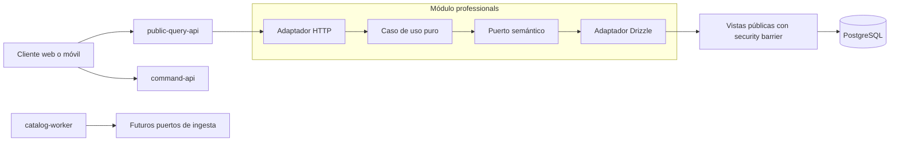

# Directorio médico — backend

[](https://github.com/eduair94/medicos-uy/actions/workflows/ci.yml)
[](https://github.com/eduair94/medicos-uy/actions/workflows/codeql.yml)
[](./LICENSE)

Base ejecutable del backend para el directorio médico de Uruguay. Es un monolito modular en
TypeScript con límites hexagonales verificables, tres procesos desplegables y un primer corte
vertical de consulta pública de profesionales.

> Estado: fundación técnica. El catálogo y su seed usan únicamente fixtures sintéticos. Los
> pipelines de investigación guardan snapshots de fuentes públicas en `data/`, fuera de Git, pero
> no los importan a PostgreSQL ni los exponen por la API. No se deben publicar antecedentes legales
> ni habilitar reseñas hasta completar las aprobaciones jurídicas, de privacidad y de fuentes
> descritas en
> [BACKEND_ARCHITECTURE.md](./BACKEND_ARCHITECTURE.md).

Este es un proyecto comunitario no oficial: no representa al MSP, a prestadores, al Colegio Médico
ni al Poder Judicial. El software y sus fixtures sintéticos son públicos; los datos descargados no
forman parte del repositorio ni quedan cubiertos por su licencia.

## Stack

- Node.js 22/24 LTS y TypeScript 6 en modo estricto.
- pnpm workspaces.
- NestJS 11 con Fastify 5.
- OpenAPI 3.0 generado y referencia interactiva Scalar.
- PostgreSQL 18, Drizzle ORM y migraciones SQL versionadas.
- Zod para configuración y `class-validator` para DTO HTTP.
- Pino con redacción de credenciales.
- Vitest, cobertura V8, Fastify `inject()` y Testcontainers.
- ESLint flat config, Prettier y dependency-cruiser.

Todas las versiones están fijadas en `pnpm-workspace.yaml` y `pnpm-lock.yaml`.

## Forma del sistema



Los procesos existentes son:

| Proceso            | Responsabilidad actual                                      | Puerto por defecto |
| ------------------ | ----------------------------------------------------------- | -----------------: |
| `public-query-api` | Búsqueda y detalle público de profesionales                 |               3001 |
| `command-api`      | Frontera futura para comandos autenticados; hoy sólo health |               3002 |
| `catalog-worker`   | Contexto standalone para futuros trabajos de catálogo       |           sin HTTP |

No se crearon módulos vacíos para reseñas, Firebase, moderación o investigación legal. Cada uno se
agregará como un corte vertical funcional y testeado cuando se implemente su primer caso de uso.

## Estructura

```text
apps/                         # composition roots desplegables
  public-query-api/
  command-api/
  catalog-worker/
packages/
  modules/
    credentials/              # títulos registrados y estado publicable
    professionals/            # primer corte vertical
    provenance/               # esquema de fuente, release y evidencia
  platform/
    config/
    database/
    health/
    http/
    observability/
    worker/
drizzle/catalog/              # esquema agregado, migraciones y seed sintético
deployment/docker/            # PostgreSQL y dos Redis con políticas separadas
docs/adr/                     # decisiones arquitectónicas
scripts/ingestion/            # descarga y normalización auditable de fuentes públicas
data/                         # snapshots locales reales; raw/processed ignorados por Git
test/setup/                   # configuración transversal de tests
```

Dentro de un módulo:

```text
domain          <- application <- presentation
                         ^
                         |
                   infrastructure
                         |
                    composition
```

- `domain` no importa frameworks ni infraestructura.
- `application` contiene casos de uso y puertos orientados al negocio.
- `infrastructure` implementa puertos.
- `presentation` adapta HTTP o jobs.
- `composition` conecta tokens, fábricas y adaptadores de Nest.
- ningún paquete puede importar una aplicación de `apps/`.

`dependency-cruiser.config.cjs` hace fallar el build si se rompe una de estas reglas.

## Requisitos

- Node.js 22.14 o superior dentro de la rama 22, o Node.js 24.15 o superior dentro de la rama 24.
- Corepack.
- Docker para PostgreSQL local y tests de integración.

No hace falta instalar pnpm globalmente; el proyecto fija pnpm 11.17.

## Arranque local

```bash
corepack pnpm install
Copy-Item .env.example .env
corepack pnpm infra:up
corepack pnpm db:migrate:catalog
corepack pnpm db:seed:catalog
corepack pnpm db:migrate:owner-research
corepack pnpm dev:public-query
```

En Bash, reemplace `Copy-Item .env.example .env` por `cp .env.example .env`.

`db:migrate:owner-research` es el único punto de entrada para ese esquema. Bajo un advisory lock y
una sola transacción valida los hashes inmutables, aplica la baseline `0006` tanto sobre un esquema
nuevo como sobre uno preexistente sin ledger, crea `research_private.schema_migration`, registra la
baseline y luego aplica `0007`. Si el ledger ya existe, verifica los hashes registrados y ejecuta
sólo las entradas faltantes. `db:verify:owner-research` exige que baseline y migraciones gestionadas
estén registradas con los hashes del manifiesto.

Con `API_DOCUMENTATION_ENABLED=true`, la documentación queda en:

- `http://localhost:3001/docs`
- `http://localhost:3001/openapi.json`
- `http://localhost:3001/.well-known/api-catalog`
- `http://localhost:3001/rsd.xml`

Todas esas superficies, igual que `/v1/**`, requieren autenticación owner. El hash incluido en
`.env.example` corresponde únicamente a la clave local descartable
`change-me-local-owner-api-key`; reemplácela antes de compartir o desplegar el servicio. Por
ejemplo:

```bash
curl -u 'owner:change-me-local-owner-api-key' http://localhost:3001/docs # gitleaks:allow - documented local placeholder
curl -H 'X-API-Key: change-me-local-owner-api-key' http://localhost:3001/v1/professionals # gitleaks:allow - documented local placeholder
```

`GET /health/live` y `GET /health/ready` permanecen públicos para el supervisor del proceso y el
balanceador.

`/openapi.json` es el contrato canónico. Scalar solo lo presenta; el catálogo well-known implementa
descubrimiento REST moderno y `rsd.xml` conserva compatibilidad con el RSD solicitado sin anunciar
APIs de blogs inexistentes. Consulte [la guía de API privada](./docs/PUBLIC_API.md).

Endpoints iniciales:

```text
GET /health/live
GET /health/ready
GET /v1/professionals?q=ana&limit=20&cursor=<opaco>
GET /v1/professionals/:idOrSlug
GET /v1/professionals/:professionalId/credentials
GET /v1/professionals/:idOrSlug/research
```

La paginación usa cursor opaco y orden estable. El adaptador sólo consulta las vistas públicas:
un perfil debe tener visibilidad `PUBLIC`; además, su fuente, finalidad, reutilización y evidencia
deben estar aprobadas y vigentes. Los slugs históricos resuelven al slug público actual. El detalle
incluye la evidencia que sostiene el nombre y el endpoint de credenciales devuelve únicamente
títulos `ENABLED`, cada uno con evidencia independiente.

El endpoint `research` es owner-only y entrega los candidatos privados del último análisis sin
convertirlos en hechos: conserva fuentes, fechas, horarios, especialidades declaradas por la
institución, método de coincidencia, índice de flexibilidad, alertas y decisiones de revisión. La
respuesta elimina identificadores HMAC, rutas y hashes internos. Los horarios no representan
disponibilidad de turnos y las especialidades de una mutualista no sustituyen los títulos MSP.

Para detener la infraestructura:

```bash
corepack pnpm infra:down
```

## Configuración

`.env.example` es el contrato local documentado. Cada proceso valida su subconjunto con Zod antes de
arrancar y termina inmediatamente ante valores inválidos.

Variables principales:

| Variable                           | Proceso     | Propósito                                      |
| ---------------------------------- | ----------- | ---------------------------------------------- |
| `CATALOG_DATABASE_URL`             | query API   | rol lector limitado a vistas públicas          |
| `CATALOG_MIGRATION_DATABASE_URL`   | migraciones | propietario con permisos DDL                   |
| `CATALOG_SEED_DATABASE_URL`        | seed local  | escritor de fixtures sintéticos                |
| `CATALOG_DATABASE_POOL_MAX`        | query API   | máximo del pool                                |
| `CATALOG_DATABASE_SSL`             | query API   | TLS con certificado verificado                 |
| `OWNER_RESEARCH_DATABASE_URL`      | query API   | rol lector para la vista de dossiers owner     |
| `OWNER_RESEARCH_DATABASE_POOL_MAX` | query API   | máximo del pool privado de sólo lectura        |
| `ALLOW_SYNTHETIC_SEED`             | seed local  | confirmación explícita; nunca habilita prod    |
| `CORS_ORIGINS`                     | APIs        | hasta 20 orígenes HTTP(S), separados por comas |
| `API_DOCUMENTATION_ENABLED`        | query API   | expone OpenAPI, Scalar y discovery             |
| `PUBLIC_API_BASE_URL`              | query API   | origen canónico usado en contratos y links     |
| `HTTP_RATE_LIMIT_MAX`              | APIs        | solicitudes por ventana                        |
| `HTTP_RATE_LIMIT_WINDOW`           | APIs        | ventana de rate limit                          |
| `OWNER_API_KEY_SHA256`             | APIs        | SHA-256 hexadecimal de la clave owner          |
| `OWNER_API_BASIC_USERNAME`         | query API   | usuario Basic; `owner` por defecto             |
| `FIREBASE_PROJECT_ID`              | APIs        | proyecto para validar Firebase ID tokens       |
| `FIREBASE_OWNER_UIDS`              | APIs        | allowlist CSV de UID owner                     |

`SWAGGER_ENABLED` se acepta como alias de transición. En producción, habilitar la documentación
obliga a declarar `PUBLIC_API_BASE_URL`; el servicio no confía en `Host` para construir URLs.

El arranque es fail-closed: se debe configurar `OWNER_API_KEY_SHA256`, o bien el par
`FIREBASE_PROJECT_ID` + `FIREBASE_OWNER_UIDS`. La clave en texto plano nunca se guarda en la
configuración. `X-API-Key` y, exclusivamente en `public-query-api`, Basic
(`OWNER_API_BASIC_USERNAME:<clave>`) comparan la clave recibida contra el hash mediante una
comparación de tiempo constante. `command-api` acepta API key o Firebase, pero nunca Basic.
Firebase Admin usa Application Default Credentials —por ejemplo `GOOGLE_APPLICATION_CREDENTIALS`—,
valida el proyecto y la firma, comprueba revocación y exige que `uid` esté en la allowlist. Si se
configuran ambos mecanismos, cualquiera de ellos puede autenticar al owner.

El límite HTTP de cuerpo es deliberadamente fijo en 1 MiB en esta etapa. Los secretos, tokens,
cookies, parámetros de búsqueda y cabeceras de App Check quedan fuera de los logs. Cada solicitud
recibe un UUID generado por el servidor, compartido por `x-request-id`, logs y `traceId` de errores;
no se confía en IDs enviados por el cliente.

El rate limit incluido protege una sola instancia y mantiene `trustProxy=false` para no aceptar
cabeceras de IP falsificadas. Antes de exponer varias réplicas detrás de un proxy se debe configurar
el salto confiable de ese entorno y aplicar el límite principal en el edge o en un almacén
distribuido.

## Datos y migraciones

El catálogo usa los esquemas PostgreSQL `catalog` y `provenance`. La migración inicial garantiza:

- slug global único y con formato seguro;
- un único slug `CURRENT` por profesional;
- perfiles públicos/suprimidos/mezclados/archivados explícitos;
- releases de fuente idempotentes;
- todo nombre publicado referencia evidencia existente;
- evidencia nueva en estado `PENDING` y publicación sólo después de `APPROVED`;
- fuente aprobada, finalidad compatible y fundamento de reutilización antes de publicar evidencia;
- evidencia candidata o vencida excluida automáticamente;
- títulos registrados separados de la visibilidad editorial del perfil;
- borrado restringido de evidencia que todavía sostiene un dato público;
- vistas `security_barrier` para profesionales, rutas y evidencia publicables;
- rol de consulta con `SELECT` únicamente sobre esas vistas, sin acceso a tablas base ni DDL.

La FK entre `catalog.professional` y `provenance.evidence_ref` se mantiene explícitamente en la
migración SQL. Esto preserva la integridad de base sin hacer que un módulo importe las tablas
Drizzle internas de otro módulo.

El seed usa dominios `.invalid` y contenido sintético. Nunca debe copiar datos reales a fixtures.
Los roles locales se crean con el script de inicialización de PostgreSQL y sus permisos finales se
aplican en la migración. Los scripts de `/docker-entrypoint-initdb.d` sólo se ejecutan al crear un
volumen nuevo. En otros entornos, `medicos_catalog_reader` se provisiona fuera de la migración
(por ejemplo con Terraform o el servicio administrado) antes de aplicarla; así el migrador no
requiere `CREATEROLE`.

El seed exige `ALLOW_SYNTHETIC_SEED=true` y se niega siempre a ejecutarse con
`NODE_ENV=production`.

La descarga del MSP y de carteleras institucionales es un flujo separado del seed. Conserva el
snapshot original, hashes, procedencia y salidas NDJSON locales sin publicar cédula ni Caja
Profesional. Los horarios obtenidos son carteleras habituales de consulta, no cupos disponibles en
tiempo real. Comandos, fuentes y límites están documentados en
[docs/DATA_INGESTION.md](./docs/DATA_INGESTION.md).

`data:build:directory` materializa todos los médicos habilitados del corte MSP y un ledger
exhaustivo de cruces institucionales. El resultado es deliberadamente interno: cada candidato queda
`ABSTAINED`, no se adjuntan horarios al perfil y `publicExportAllowed` permanece en `false` hasta
completar revisión humana, autorización de fuente y la
[compuerta de privacidad y publicación](./docs/PRIVACY_PUBLICATION_GATE.md). Un disclaimer no
reemplaza esas obligaciones.

`data:build:public-directory` es la única ruta hacia un NDJSON sanitizado. Exige una política
externa aprobada y vigente, su firma Ed25519 separada, una clave pública cuya huella SHA-256 está
anclada en configuración, una allowlist exacta y un secreto distinto para generar IDs públicos. La
política autoriza un único `snapshotId` y `profilesSha256`, fija la antigüedad máxima de la fuente y
no selecciona artefactos por fecha de modificación. También exige aprobaciones firmadas del aviso
del responsable, registro de base, circuito de derechos, seguridad/retención y determinación de
EIPD/DPO.

También valida el contrato factual-v3, toda la cadena de entradas, el aviso legal, el ledger de
abstenciones, hashes, fechas y salvaguardas. Tanto el snapshot interno como el manifiesto y los
perfiles públicos se instalan por renombre atómico de directorio; la vigencia publicada es el menor
vencimiento entre la política y la autorización de fuente. El manifiesto público identifica la
clave firmante, pero no publica una huella derivada del secreto usado para los IDs.

Los artefactos no se montan como archivos estáticos. La única apertura soportada para una futura
capa de entrega es `readPublicDirectoryArtifactForDelivery`, que vuelve a comprobar ruta, hash,
conteo, salvaguardas, HMAC del manifiesto y vencimiento antes y después de leer el contenido; al
vencer o detectar una falsificación, falla sin devolver perfiles. El contrato devuelve únicamente
los bytes de perfiles verificados y no expone su ruta, para impedir que un consumidor reabra un
archivo mutable después de la comprobación. La clave de autenticación del
artefacto y el secreto usado para derivar IDs deben ser valores aleatorios distintos de al menos 32
bytes, codificados como base64 o base64url canónico; el proceso rechaza su reutilización.
La plantilla
[`config/source-publication-policy.example.json`](./config/source-publication-policy.example.json)
está deliberadamente desaprobada y hace que el comando falle sin escribir una exportación.

## Actualización diaria

El plan diario puede auditarse sin realizar descargas:

```bash
corepack pnpm data:refresh:daily:plan
```

La ejecución real:

```bash
corepack pnpm data:refresh:daily
```

actualiza MSP, adaptadores de mutualistas, índices de noticias autorizados, candidatos en cuarentena
y el snapshot interno. Usa un orden fijo y se detiene ante la primera falla. La exportación pública
está desactivada por defecto y, aun al habilitarla, exige una política externa firmada.

Se incluyen un wrapper para cron y un timer systemd, ambos con `flock`, archivo de entorno externo,
estado JSON, permisos restrictivos y ejecución diaria. Active solo uno. La instalación,
monitorización, recuperación y límites están en
[Operación de la actualización diaria](./docs/OPERATIONS_DAILY_REFRESH.md).

El job no muta PostgreSQL: la API conserva el último release explícitamente aprobado. Esto evita
presentar como “publicado” un dato recién recolectado que todavía no pasó los controles de
identidad, fuente y privacidad.

La búsqueda inicial usa `ILIKE` sobre el nombre normalizado. Es suficiente para fixtures y validar
el flujo, pero antes de importar el padrón completo se deben incorporar `unaccent`, `pg_trgm` o FTS,
un índice GIN y mediciones con datos representativos.

Al modificar un esquema:

```bash
corepack pnpm db:generate:catalog
corepack pnpm db:migrate:catalog
```

No se usa `drizzle-kit push`: las migraciones generadas se revisan y se versionan.

## Calidad y pruebas

Comando normal antes de abrir un PR:

```bash
corepack pnpm quality
```

Incluye formato, lint type-aware, reglas arquitectónicas, typecheck, unit tests, E2E y build.

Comprobaciones adicionales:

```bash
corepack pnpm test:coverage
corepack pnpm test:integration
corepack pnpm quality:full
```

`test:integration` inicia PostgreSQL 18 con Testcontainers y necesita Docker. Comprueba migraciones,
visibilidad y evidencia públicas, paginación keyset, resolución de slugs, la FK entre módulos y que
el rol lector no pueda consultar tablas base ni ejecutar DDL.

La cobertura exige como mínimo:

- global: 80 % statements, 75 % branches, 80 % functions y 80 % lines;
- capas `domain` y `application`: 90 %, 85 %, 90 % y 90 %, respectivamente.

## Cómo agregar el siguiente módulo

1. Definir el lenguaje y las invariantes en `domain`.
2. Crear un caso de uso puro y puertos pequeños en `application`.
3. Testear el caso de uso sin Nest ni base de datos.
4. Implementar un adaptador en `infrastructure`.
5. Exponer un adaptador HTTP/job delgado en `presentation`.
6. Conectar dependencias con fábricas en `composition`.
7. Agregar tests de contrato, integración y autorización negativa.
8. Actualizar migraciones, ADR y contrato OpenAPI.

El siguiente corte recomendado para reseñas debe incluir en una sola entrega:

- Firebase ID token y App Check;
- principal local y autorización;
- emulador de Firebase;
- borrador privado;
- moderación antes de publicación;
- reportes, trazabilidad y pruebas de no filtración.

Firebase autentica una cuenta; no verifica una consulta médica ni la veracidad de una reseña.

## Documentación

- [Arquitectura completa](./BACKEND_ARCHITECTURE.md)
- [Contrato y descubrimiento de la API privada](./docs/PUBLIC_API.md)
- [Configuración segura de PostgreSQL](./docs/POSTGRES_CONFIGURATION.md)
- [Operación de la actualización diaria](./docs/OPERATIONS_DAILY_REFRESH.md)
- [Ingesta de fuentes públicas](./docs/DATA_INGESTION.md)
- [Aviso de privacidad y compuerta de publicación](./docs/PRIVACY_PUBLICATION_GATE.md)
- [Borrador de consulta a la URCDP](./docs/URCDP_CONSULTATION_DRAFT.md)
- [Investigación de expedientes y antecedentes](./docs/LEGAL_RECORDS_RESEARCH.md)
- [ADR-0001: fundación del backend](./docs/adr/0001-backend-foundation.md)
- [ADR-0002: credenciales y publicación fail-closed](./docs/adr/0002-fail-closed-publication-and-credentials.md)

## Código abierto

El código se distribuye bajo [MIT](./LICENSE). Lea
[DATA_LICENSES.md](./DATA_LICENSES.md): la licencia no alcanza datos ni contenidos de terceros.

- [Cómo contribuir](./CONTRIBUTING.md)
- [Política de seguridad](./SECURITY.md)
- [Código de conducta](./CODE_OF_CONDUCT.md)

No adjunte datos personales reales a issues o pull requests. Las solicitudes de corrección,
rectificación o supresión deberán usar el canal del responsable de datos cuando exista un
despliegue público; el repositorio no es en sí mismo una base pública de profesionales.
